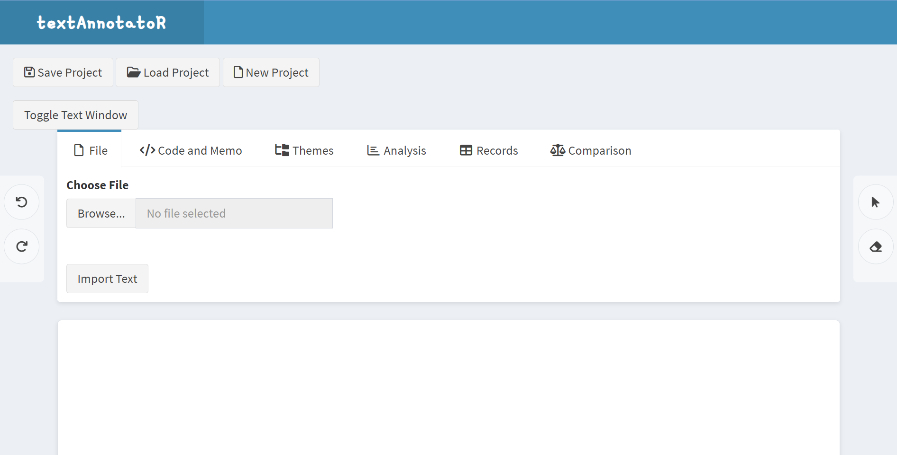

# Summary

 textAnnotatoR is an interactive text annotation tool implemented in R using the Shiny framework. It provides researchers with a user-friendly graphical interface for qualitative text analysis that combines systematic coding, annotation, and analysis of textual data. The tool addresses the need for accessible and open-source solutions in qualitative research, particularly for researchers who work within the R ecosystem but require the functionality typically found in commercial qualitative data analysis software.

The package facilitates the entire workflow of qualitative text analysis, from importing text documents to generating analytical insights. Researchers can highlight text segments, apply codes, create memos, organize codes hierarchically into themes, and analyze coding patterns. The interactive interface makes the coding process intuitive while maintaining the rigor required for qualitative research.

# Statement of need

Qualitative text analysis is a key research method in the social sciences, humanities, and other fields that require in-depth understanding of textual content. While commercial software packages such as ATLAS.ti, MAXQDA, and NVivo are available for qualitative data analysis (QDA), they are often expensive and offer limited compatibility with other research tools [hart2017qualitative]. The discontinuation of RQDA, a once-popular open-source QDA software [huang2014rqda], has further created a gap for social scientists seeking robust and cost-effective tools for coding and analyzing qualitative data. This gap is particularly evident among researchers and students who use R for quantitative analysis, as they lack integrated options for performing qualitative analysis within the same computational environment.

textAnnotatoR addresses these needs by providing:

- An open-source alternative to commercial QDA software
- Seamless integration with the R ecosystem
- Interactive text annotation capabilities
- Hierarchical code organization
- Built-in analytical tools for code pattern analysis
- Export functionality for further analysis
- Version control compatibility

Additionally, textAnnotatoR incorporates quantitative descriptive analyses of qualitative coding to support the integration of qualitative and quantitative methods and enhance reproducible research workflows.

# Key Features and Functionality

textAnnotatoR offers several core features essential for qualitative text analysis:

- **Text Import and Display**: Supports various text file formats (TXT, DOCX, PDF) and provides a clear interface for reading and displaying text documents.
- **Interactive Code Application**: Users can select text segments and apply codes through an intuitive point-and-click interface.
- **Hierarchical Code Organization**: Codes can be organized into themes and sub-themes, supporting complex analytical frameworks.
- **Memo Creation**: Researchers can attach memos to coded segments, documenting their analytical thoughts and interpretations.
- **Project Management**: Projects can be saved and loaded, ensuring work continuity and collaboration possibilities.
- **Analysis Tools**: Built-in tools for analyzing code frequencies, co-occurrences, and patterns.
- **Code Comparison**: Functionality to compare coding patterns between different researchers or coding sessions.
- **Export Capabilities**: Results can be exported in various formats (CSV, JSON, HTML) for further analysis or reporting.

# Implementation

textAnnotatoR is built using R [@R] and Shiny [@shiny], leveraging several key packages for functionality:

- `shiny` and `shinydashboard` for the interactive web interface [@shiny; @shinydashboard]
- `data.tree` for managing hierarchical code structures [@datatree]
- `DT` for displaying and managing tabular data [@DT]
- `jsonlite` for data serialization [@jsonlite]
- `readtext` for importing various text formats [@readtext]

 The package follows a modular design pattern that separates the user interface, server logic, and data management components. This architecture facilitates maintenance and allows for future extensions of functionality.

The interactive annotation interface is implemented using custom JavaScript handlers integrated with Shiny's reactive framework, enabling smooth user interactions while maintaining data consistency. The hierarchical code management system uses a tree structure that supports complex qualitative coding frameworks and analyses.

# Examples of Use

textAnnotatoR can be used in various research contexts, including:

1. **Qualitative Research Analysis**
   - Coding and analysis of interview transcripts
   - Processing of focus group discussions
   - Analysis of open-ended survey responses

2. **Literature Review and Document Analysis**
   - Systematic literature reviews requiring text coding
   - Content analysis of policy documents
   - Thematic analysis of research papers

3. **Educational Applications**
   - Teaching qualitative research methods
   - Student research projects
   - Collaborative coding exercises

4. **Team-based Research**
   - Multi-coder projects with code comparison features
   - Standardized coding procedures across research teams
   - Quality assessment of coding consistency

Researchers can start using the tool with a simple R command:

```r
library(textAnnotatoR)
annotate_gui()
```

This launches the interactive interface where users can import texts, create codes, and begin their analysis. The tool supports a complete workflow from initial coding to final analysis and reporting.



*Figure 1: The main interface of textAnnotatoR showing key features including project management options (top), file import functionality (left panel), and various tabs for coding, theme organization, analysis, and comparison.*

# Comparison with Existing Tools

While several qualitative data analysis tools exist, textAnnotatoR differentiates itself through:

1. **Open Source Nature**: Unlike commercial QDA software like NVivo or ATLAS.ti, textAnnotatoR is freely available and open source.
2. **R Integration**: Direct integration with R's statistical and analytical capabilities, unlike standalone QDA tools.
3. **Modern Interface**: Built using Shiny's modern web technologies, providing a more contemporary user experience compared to older R-based text analysis tools.
4. **Extensibility**: Being open source and R-based, researchers can extend functionality to meet specific needs.

# Acknowledgements

We acknowledge contributions from the R and Shiny communities, whose tools and packages made this project possible. 

# References
