# Summary

textAnnotatoR is an interactive text annotation tool implemented in R using the Shiny framework. It provides researchers with a user-friendly graphical interface for qualitative text analysis that combines systematic coding, annotation, and analysis of textual data. The tool addresses the need for accessible, open-source solutions in qualitative research, particularly for researchers conducting interview analysis, focus group studies, literature reviews, and content analysis who require seamless integration with R's statistical and visualization capabilities. The package facilitates the entire workflow of qualitative text analysis, from importing text documents to generating analytical insights through an intuitive interface that maintains the rigor required for qualitative research.

# Statement of need

Qualitative text analysis is fundamental to research in social sciences, humanities, education, and other fields requiring in-depth understanding of textual data. Researchers typically face a choice between expensive commercial software and limited open-source alternatives, each with significant trade-offs.

## Commercial Tools and Their Limitations

Leading commercial qualitative data analysis (QDA) software packages including ATLAS.ti, MAXQDA, and NVivo offer comprehensive functionality but present several barriers:

- **Cost barriers**: License fees, which can range from hundreds to thousands of dollars annually, pose a significant financial barrier for individual researchers, students, and budget-constrained institutions
- **Workflow integration**: These standalone applications operate in isolation from statistical analysis environments that require researchers to export data for quantitative analysis or visualization in separate tools
 - **Reproducibility challenges**: Commercial tools often use proprietary formats and closed-source algorithms, making it difficult to document and reproduce analytical workflows
- **Learning curve**: Each tool requires mastering a unique interface and workflow, with limited transferability between platforms

## Open-Source Landscape and Gaps

The discontinuation of RQDA [@huang2014rqda], a once-popular open-source QDA tool, created a significant gap in the ecosystem. Current open-source alternatives each address specific needs but leave important gaps:

**Taguette** [@Rampin2021] provides an accessible web-based interface for basic text annotation and hierarchical coding. However, it lacks integration with statistical environments and offers limited analytical capabilities beyond basic frequency counts.

**LaMa** [@Bogachenkova2023] excels in collaborative annotation and conflict resolution for machine learning applications but is primarily designed for thematic labeling rather than comprehensive qualitative analysis workflows.

**qc** [@Proctor2024] bridges computational and qualitative approaches through a command-line interface but requires significant programming expertise, which limits accessibility for researchers without technical backgrounds.

**corporaexplorer** [@Gjerde2019] offers powerful visualization capabilities for large text corpora but focuses on exploratory analysis rather than detailed coding and systematic qualitative analysis.

## The R Integration Advantage

textAnnotatoR addresses these gaps by providing comprehensive QDA functionality within the R ecosystem, with the following advantages:

**Unified analytical workflow**: Researchers can conduct qualitative coding, generate quantitative summaries of coding patterns, create publication-ready visualizations, and perform mixed-methods analysis within a single environment, eliminating the need to export and import data across multiple platforms.

**Reproducible research**: All analytical steps can be documented in R scripts, enabling complete reproducibility of both qualitative coding decisions and subsequent analyses—a critical requirement for transparent and rigorous research.

**Advanced statistical integration**: Researchers can immediately apply R's extensive statistical capabilities to coded data, including inter-rater reliability calculations, pattern analysis, and integration with survey or experimental data.

**Custom analytical extensions**: The open-source R environment allows researchers to develop custom analysis functions tailored to specific research questions or methodological approaches.

**Cost-effective scalability**: Institutions can deploy textAnnotatoR across unlimited users without licensing restrictions, making it particularly valuable for teaching and collaborative research projects.

# Key Features and Functionality

textAnnotatoR offers comprehensive functionality for qualitative text analysis:

- **Multi-format text import**: Supports TXT, DOCX, and PDF formats with encoding detection and formatting preservation
- **Interactive coding interface**: Point-and-click text selection with real-time highlighting and code application
- **Hierarchical code organization**: Multi-level theme and code structures supporting complex analytical frameworks
- **Comprehensive memo system**: Attach detailed memos to coded segments with full text search and organization
- **Advanced project management**: Save, load, and backup projects with version control and collaboration features
- **Built-in analysis tools**: Code frequency analysis, co-occurrence matrices, pattern detection, and statistical summaries
- **Flexible export options**: Generate reports in CSV, JSON, HTML, and formatted text for publication or further analysis
- **Integration with R ecosystem**: Direct compatibility with tidyverse, ggplot2, and other R packages for extended analysis

# Implementation

textAnnotatoR is built using R [@R] and Shiny [@shiny], leveraging several key packages:

- `shiny` and `shinydashboard` for the interactive web interface [@shiny; @shinydashboard]
- `data.tree` for managing hierarchical code structures [@datatree]
- `DT` for interactive data tables [@DT]
- `jsonlite` for data serialization and export [@jsonlite]
- `readtext` for importing various text formats [@readtext]

The package follows a modular design with separated user interface, server logic, and data management components. The interactive annotation interface uses custom JavaScript handlers integrated with Shiny's reactive framework, enabling smooth user interactions while maintaining data consistency. The hierarchical code management system employs tree structures that support complex qualitative coding frameworks while ensuring efficient data storage and retrieval.

# Examples of Use

## Practical Workflow: Analyzing Remote Work Interview Data

To demonstrate textAnnotatoR's capabilities, we present a complete analysis workflow using a fictional interview about remote work experiences. This example illustrates how researchers can progress from raw text to analytical insights using the tool's integrated features.

### Project Initialization and Setup

Researchers begin by launching the interactive interface and setting up their project environment:

```r
library(textAnnotatoR)
annotate_gui()
```

Upon first launch, textAnnotatoR guides users through storage configuration, which allows them to choose between R's default user directories or custom locations for their research data.

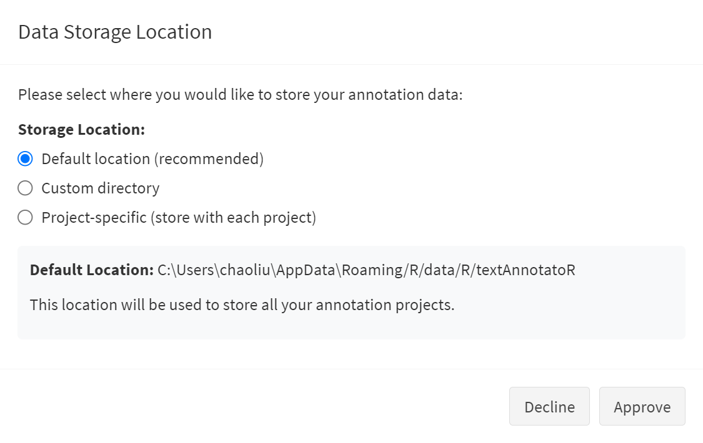
**Figure 1**: Initial setup dialog for configuring project storage location.

After storage setup, users create a new project and import their text data. For this example, we use an interview transcript discussing remote work transitions:

<pre>
<b>Interviewer</b>: Can you describe your experience transitioning to remote work?

<b>Participant</b>: It was definitely challenging at first. The biggest issues were setting up a proper workspace at home and establishing boundaries between work and personal life. It took about a month to develop a routine that worked. Now, I actually prefer working remotely. I'm more productive without office distractions, and I save two hours daily by not commuting.

<b>Interviewer</b>: What tools have been most helpful?

<b>Participant</b>: Video conferencing has been essential - we use Zoom for meetings. We also rely on Slack for communications and Asana for project management. My company provided a monitor and ergonomic chair, which made a huge difference. The technology was easy to adapt to, but the social aspects were harder. It's difficult to replace those impromptu conversations by the coffee machine.

<b>Interviewer</b>: How has remote work affected your work-life balance?

<b>Participant</b>: It's a double-edged sword. I have more flexibility and time with family, but it's also harder to disconnect. Sometimes I find myself checking emails well into the evening, which wasn't a habit before. I've had to be intentional about setting working hours and sticking to them. Taking short walks during the day has become my substitute for the natural breaks that happened in the office.
</pre>

### Interactive Text Annotation
The core functionality involves selecting text segments and applying analytical codes. Users activate the selection tool and highlight relevant text passages.

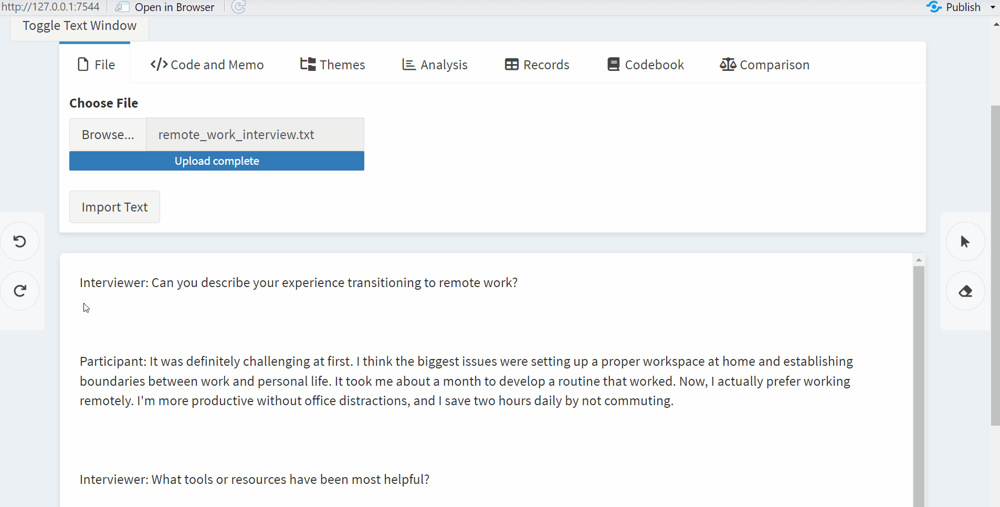
**Figure 2**: Real-time coding process showing text selection, code creation, and immediate visual feedback through color-coded highlights.

For our remote work analysis, researchers might identify several initial codes:

- **Home Setup**: Workspace configuration challenges and solutions

- **Boundary Issues**: Work-life balance difficulties

- **Technology**: Tools and platforms used for remote work

- **Social Isolation**: Missing interpersonal workplace interactions

Each coded segment can include detailed memos documenting code insights.

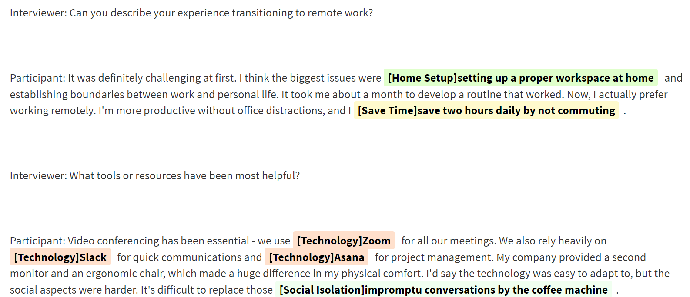
**Figure 3**: Annotation interface displaying some of the coded segments.

## Code Management and Organization
 As analysis progresses, researchers can apply existing codes to new text segments using the "Apply Code" feature to streamline the coding process.

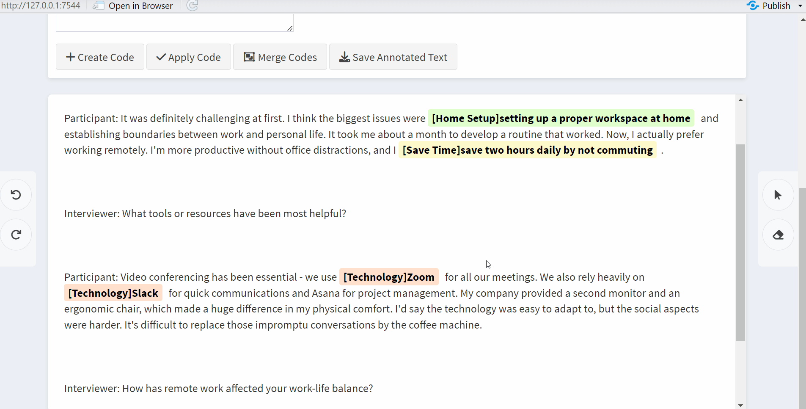
**Figure 4**: Efficient code application using the dropdown menu for previously created codes.

textAnnotatoR also supports code refinement through merging similar concepts. For instance, codes like "Home Setup" and "Social Isolation" might be merged into a broader "Physical Environment" category.

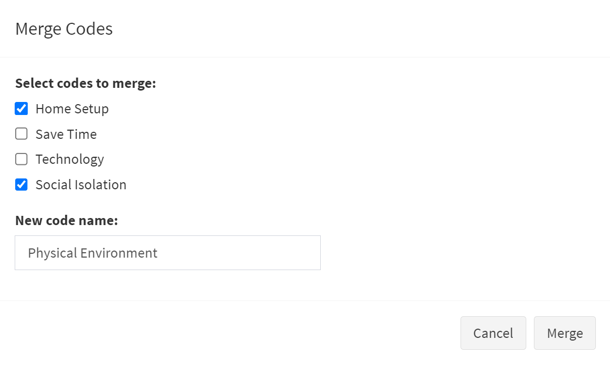
**Figure 5**: Code merging interface that allows researchers to consolidate conceptually similar codes for cleaner analysis.

## Hierarchical Theme Development
Beyond basic coding, textAnnotatoR supports hierarchical organization of codes into analytical themes. Researchers can create thematic categories and organize related codes under the **Themes** tab.

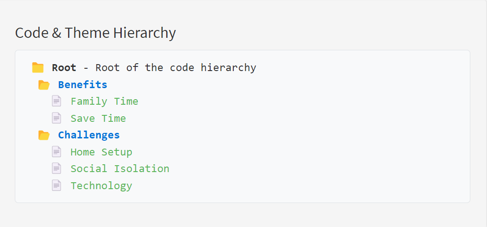
**Figure 6**: Hierarchical organization that shows codes grouped under broader themes.

## Pattern Analysis and Insights
textAnnotatoR provides built-in analytical tools for examining coding patterns. The frequency analysis reveals which codes dominate the data.

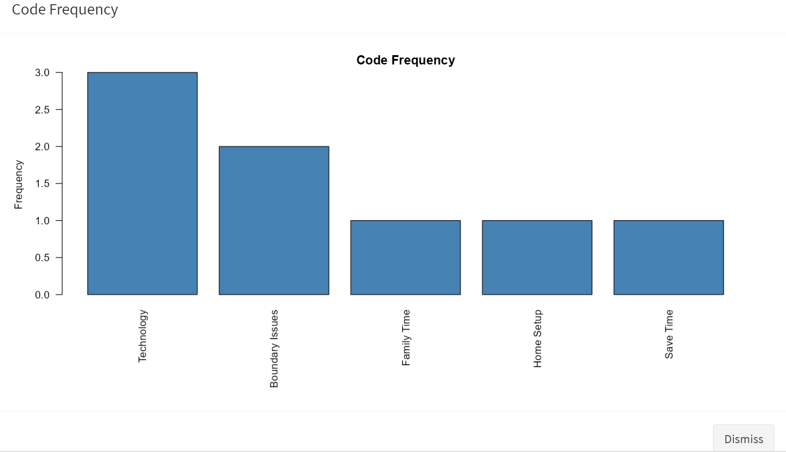
**Figure 7**: Code frequency analysis revealing that "Technology" and "Boundary Issues" are the most prevalent themes in the interview data.

 Co-occurrence analysis helps uncover potential relationships between different concepts by revealing codes that frequently appear together. For example, "Home Setup" and "Save Time" often co-occur, suggesting that participants associate their home work environment with increased efficiency. In contrast, the frequent co-occurrence of "Boundary Issues" and "Family Time" points to an underlying tension between personal life and work (see Figure 8).

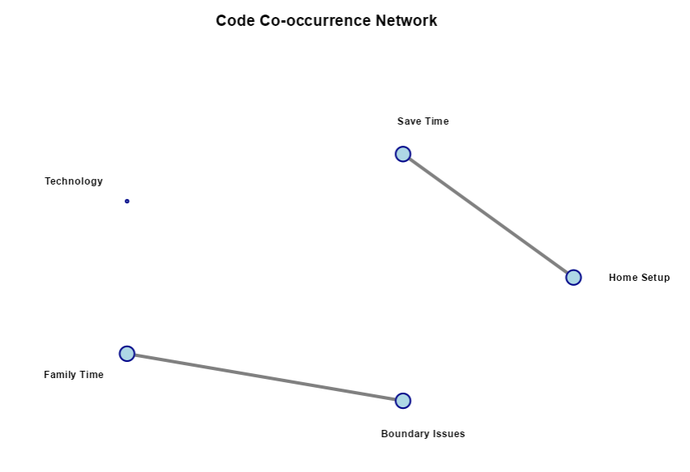
**Figure 8**: Network visualization of co-ocurring codes.

*Note*: Node size reflects total co-occurrences. Line thickness indicates Jaccard similarity strength. Line opacity shows phi coefficient magnitude. 

## Data Integration and Export
The analysis culminates in data export for further analysis or reporting. textAnnotatoR supports multiple formats to integrate with various research workflows.

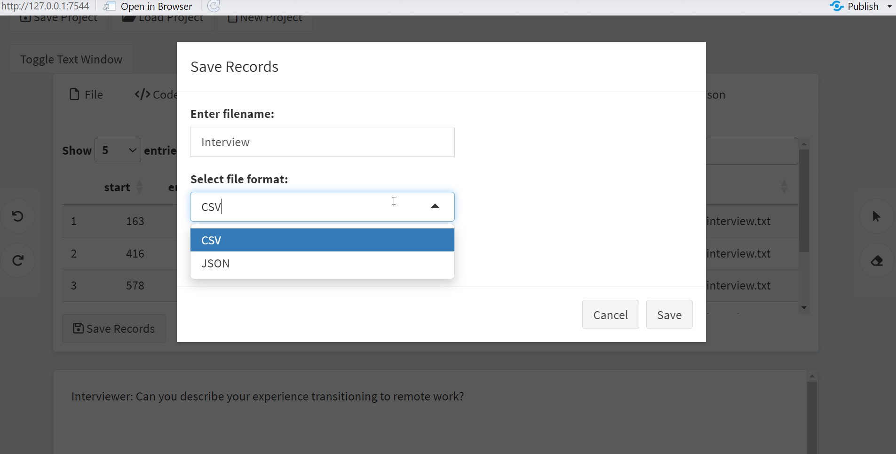
**Figure 9**: Export interface offering multiple formats (CSV, JSON) for integration with statistical software or publication workflows.

Researchers can export:

- Raw annotation data (CSV format) for quantitative analysis in R or other statistical software

- Hierarchical code structures (JSON format) for documentation or sharing with collaborators

- Annotated text (HTML format) for presentations or supplementary materials

## Collaborative Analysis and Reliability Assessment
For team-based research, textAnnotatoR includes inter-coder comparison tools. Two researchers can code the same text independently, then compare their analyses.

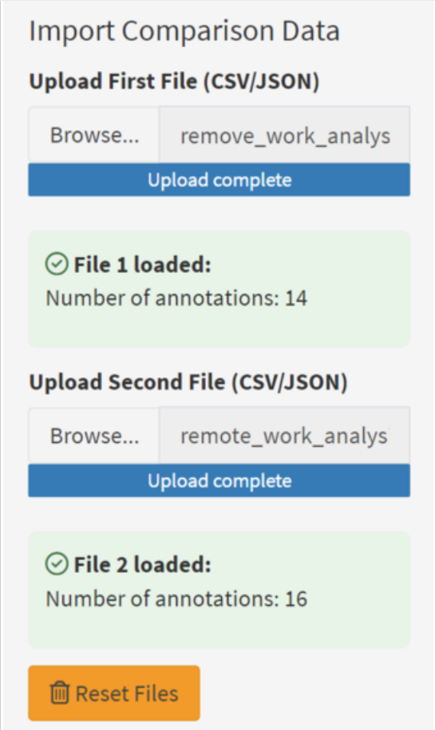
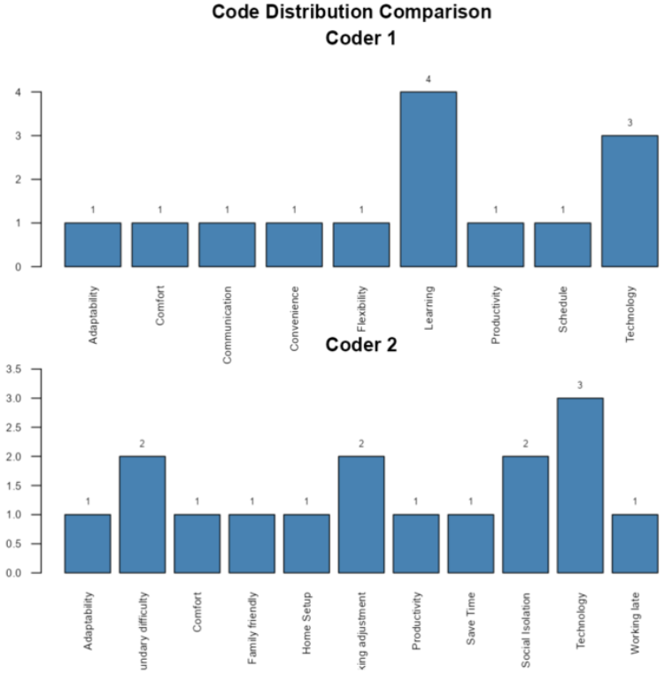
**Figure 10**: Comparison analysis interface that shows coding differences between two researchers, with visual indicators of agreement and discrepancy areas.

# Acknowledgements
We acknowledge contributions from the R and Shiny communities, whose tools and packages made this project possible.
