```{r setup, include=FALSE}
knitr::opts_chunk$set(
  collapse = TRUE,
  comment = "#>",
  fig.width = 3,
  fig.height = 5,
  fig.align = 'center',
  fig.path = "man/figures/"
)
library(textAnnotatoR)
```

# Introduction

This vignette provides a step-by-step practical example of using the textAnnotatoR package for qualitative analysis. We'll work through a complete example project, from importing text to analyzing coded content. You'll learn how to:

1. Set up a project
2. Import text data
3. Annotate text
4. Manage project files (saving, loading, and organizing)
5. Analyze patterns within coded data
6. Export results

# Setting Up textAnnotatoR

Before diving into the sample project, let's understand how to properly set up textAnnotatoR and navigate its interface.

## Installation

If you haven't installed textAnnotatoR yet, you can install it from GitHub:

```{r eval=FALSE}
# Install devtools if not already installed
if (!requireNamespace("devtools", quietly = TRUE)) {
  install.packages("devtools")
}

# Install textAnnotatoR
devtools::install_github("chaoliu-cl/textAnnotatoR")
```

## First-Time Setup

The first time you run textAnnotatoR, it will ask you to confirm where you want to store your project data:

```{r eval=FALSE}
library(textAnnotatoR)
annotate_gui()
```

You'll see a dialog asking you to choose between:
1) Default Location: A folder managed by R in your user directory
2) Custom Location: A directory of your choice

```{r, out.width = "600px", echo=FALSE}
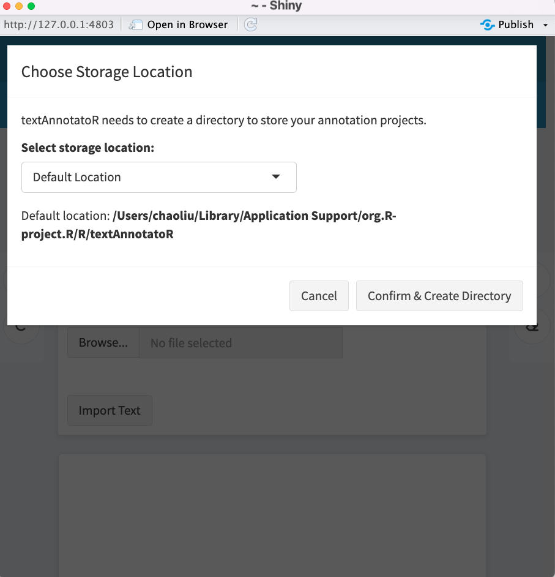
```

If you choose "Custom Location," you'll need to navigate to and select your preferred directory. This directory will store all your textAnnotatoR projects.

## Understanding the Interface

When textAnnotatoR launches, you'll see several tabs:

- **File**: Import text and manage projects
- **Code and Memo**: For managing codes and adding memos
- **Themes**: Organize codes into themes and hierarchies
- **Analysis**: Analyze coding patterns
- **Records**: View all annotations in tabular format
- **Comparison**: Compare coding between different coders

# Sample Project: Analyzing Interview Responses

For this example, we'll be analyzing fictional interview responses about remote work experiences. The example demonstrates how you might use textAnnotatoR in a real qualitative research context.

## Step 1: Creating a New Project

When you first launch textAnnotatoR, it automatically creates a blank project. However, if you want to start a new project, click "New Project" in the top toolbar

```{r, out.width = "700px", echo=FALSE}
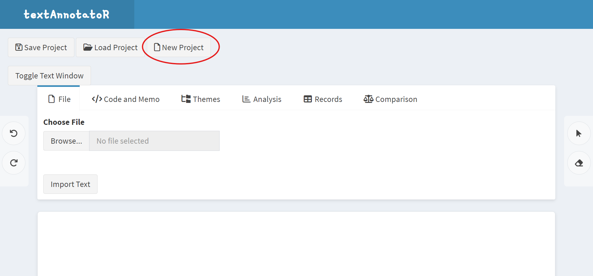
```

If you have unsaved changes in your current project, you'll see a confirmation dialog asking if you want to save your current project first:

```{r, out.width = "550px", echo=FALSE}
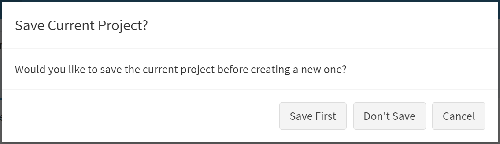
```

## Step 2: Importing Text Data

For this example, we'll use the following interview excerpt. You can copy this text into a file named `remote_work_interview.txt`:

```
Interviewer: Can you describe your experience transitioning to remote work?

Participant: It was definitely challenging at first. I think the biggest issues were setting up a proper workspace at home and establishing boundaries between work and personal life. It took me about a month to develop a routine that worked. Now, I actually prefer working remotely. I'm more productive without office distractions, and I save two hours daily by not commuting.

Interviewer: What tools or resources have been most helpful?

Participant: Video conferencing has been essential - we use Zoom for all our meetings. We also rely heavily on Slack for quick communications and Asana for project management. My company provided a second monitor and an ergonomic chair, which made a huge difference in my physical comfort. I'd say the technology was easy to adapt to, but the social aspects were harder. It's difficult to replace those impromptu conversations by the coffee machine.

Interviewer: How has remote work affected your work-life balance?

Participant: It's a double-edged sword. I have more flexibility and time with family, but it's also harder to disconnect. Sometimes I find myself checking emails well into the evening, which wasn't a habit before. I've had to be intentional about setting working hours and sticking to them. Taking short walks during the day has become my substitute for the natural breaks that happened in the office.
```

## Step 3: Saving Your Project

It's important to save your project regularly. To do that,  click on "Save Project"

```{r, out.width = "650px", echo=FALSE}
knitr::include_graphics("../man/figures/save_project.png")
```

Then, a dialog will appear:

```{r, out.width = "650px", echo=FALSE}
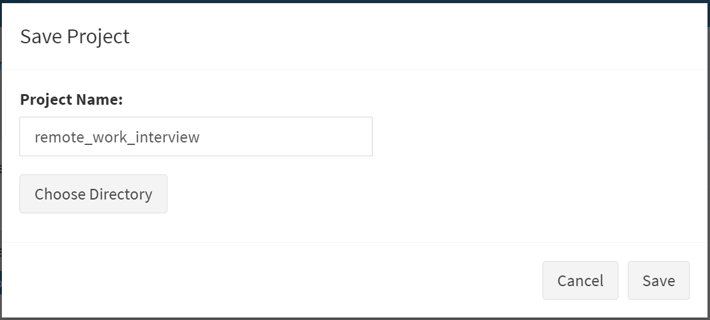
```

   - Type in your project name
   - Click "Choose Directory" to select where to save the project
   - Directories are displayed in a hierarchical format - navigate to your desired location
   - Click "Save" to save your project

The project will be saved as an RDS file, which preserves all your annotations, codes, and project structure.


## Step 4: Annotating the Text

Now let's start coding our interview text:

1. Click the selection tool (cursor icon) in the right margin
3. Select text discussing the home workspace setup
4. In the "Code and Memo" tab, enter "Home Setup" as the code
5. Add a memo: "Initial challenge in transition to remote work"
6. Click "Save" to save the code

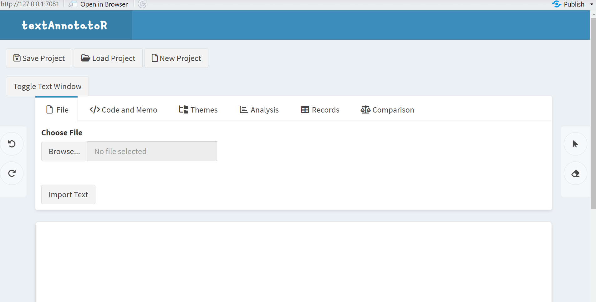

Continue this process for other notable segments in the text. For example:

- Code Zoom, Slack, and Asana as "Technology"
- Code "save two hours daily by not commuting" as "Save Time"
- Code discussions of missed impromptu conversations as "Social Isolation"

Your annotated text will begin to look like this, with different colored highlights representing different codes:

```{r, out.width = "700px", echo=FALSE}
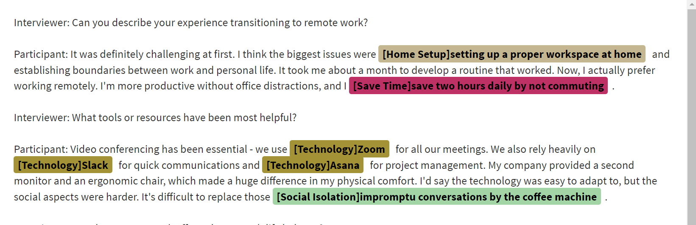
```

### Applying Existing Codes
<<<<<<< HEAD

Once you've created some codes, you can apply them to new text segments:

1. Highlight the target text
2. Click on "Apply Code" in the side panel 
3. Choose the code you want to apply from the dropdown menu
=======
>>>>>>> 8b9da0ab7d9d9136c1d451b6679666ff966fe139

Once you've created some codes, you can apply them to new text segments:

1. Highlight the target text
2. Click on "Apply Code" in the side panel 
3. Choose the code you want to apply from the dropdown menu

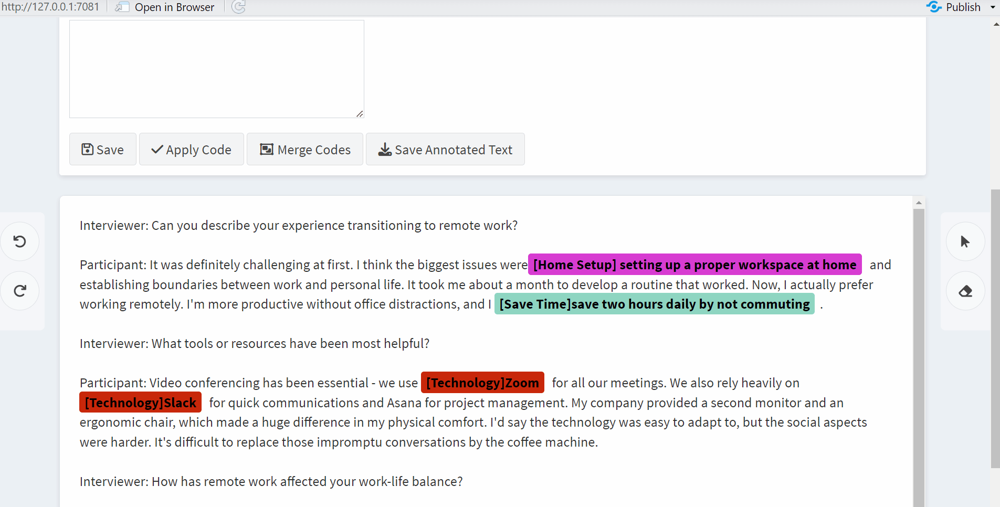

### Managing Codes

As your coding progresses, you'll want to manage your codes efficiently. You can click on the highlighted text to:

- Replace code
- Rename code
- Delete code

```{r, out.width = "650px", echo=FALSE}
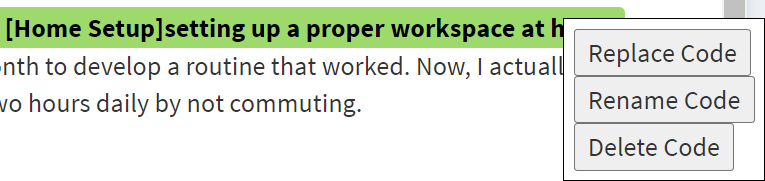
```
   
   
### Merging Similar Codes

In some instances, you might find that some of your codes are conceptually similar or overlapping. textAnnotatoR provides a "Merge Codes" feature to consolidate these:

1. Go to the "Code and Memo" tab
2. In the "Codes" section, select two or more codes by checking the boxes next to them
3. Click the "Merge Codes" button
4. A dialog will appear asking you to name the new merged code:
   - Enter a descriptive name that encompasses the concepts being merged
   - Click "Merge" to confirm

```{r, out.width = "650px", echo=FALSE}
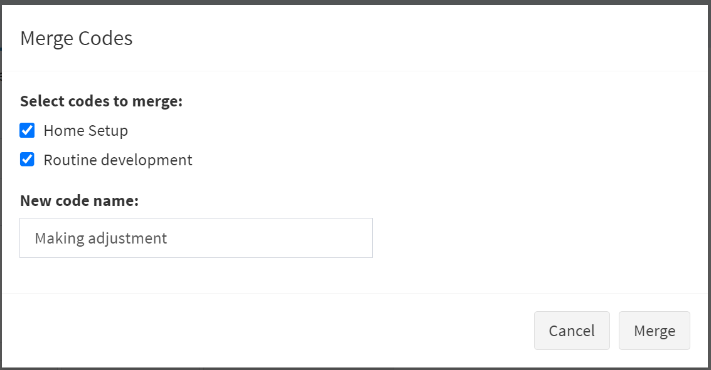
```

<<<<<<< HEAD
### Managing Codes

As your coding progresses, you'll want to manage your codes efficiently. You can click on the highlighted text to:

- Replace code
- Rename code
- Delete code

```{r, out.width = "650px", echo=FALSE}

```
   
   
### Merging Similar Codes

In some instances, you might find that some of your codes are conceptually similar or overlapping. textAnnotatoR provides a "Merge Codes" feature to consolidate these:

1. Go to the "Code and Memo" tab
2. In the "Codes" section, select two or more codes by checking the boxes next to them
3. Click the "Merge Codes" button
4. A dialog will appear asking you to name the new merged code:
   - Enter a descriptive name that encompasses the concepts being merged
   - Click "Merge" to confirm

```{r, out.width = "650px", echo=FALSE}

```

=======
>>>>>>> 8b9da0ab7d9d9136c1d451b6679666ff966fe139
This feature is particularly useful when:

- Your initial coding was very granular and you now want broader categories
- Multiple codes have emerged that represent the same underlying concept
- You want to simplify your coding scheme for analysis or reporting

## Step 5: Loading Your Project

If you need to continue your work later, you'll need to load your saved project: Click "Load Project".

```{r, out.width = "650px", echo=FALSE}
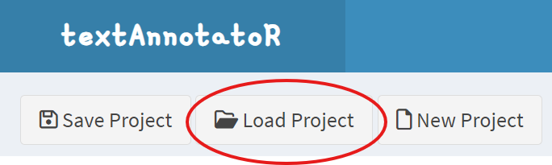
```

Then a dialog will appear:
```{r, out.width = "650px", echo=FALSE}
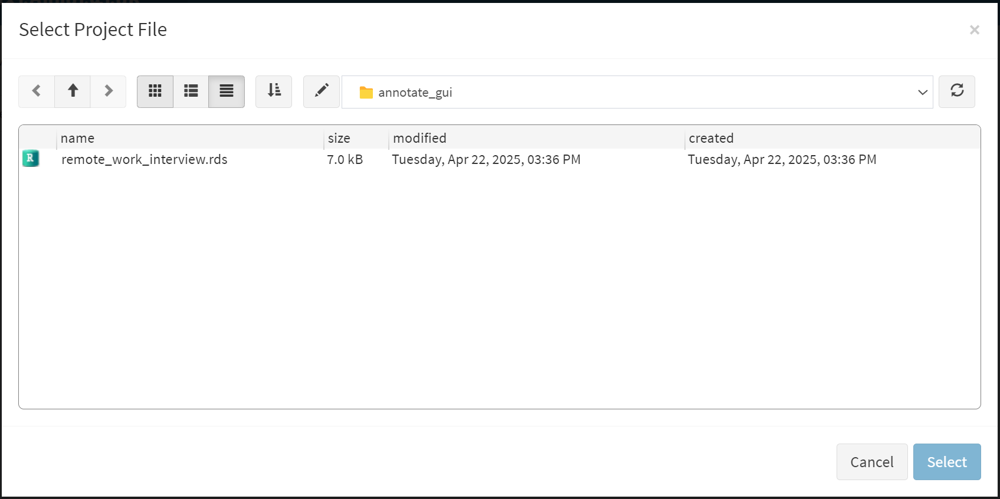
```

   - Click "Choose Project File" to navigate to your saved project file
   - Navigate through the directory structure to find your project
   - Select the RDS file and click "Select"
   - Click "Load" to load your project

All your text, annotations, codes, and memos will be restored exactly as you left them.

## Step 6: Analyzing the Coded Data

Once you've coded the entire interview, use the analysis tools to examine patterns:

### Code Frequency Analysis

Go to the "Analysis" tab and click "Code Frequency". This will show which codes were mentioned most often:

```{r, out.width = "700px", echo=FALSE}
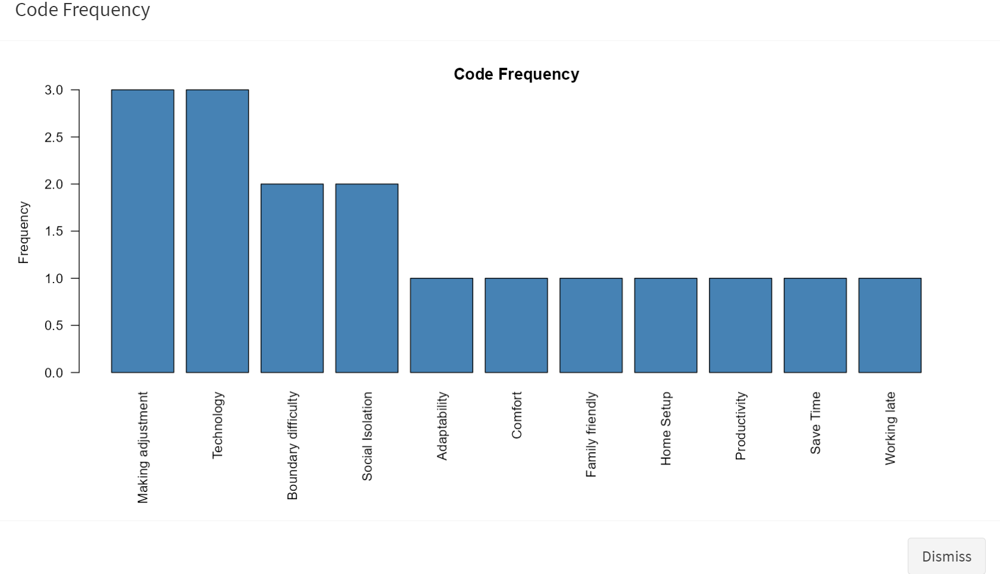
```

In our example, we might see that "Making adjustment" and "Technology" appear most frequently, indicating these are significant aspects of the remote work experience for our participant.

### Code Co-occurrence Analysis

Click "Code Co-occurrence" to see relationships between different codes:

```{r, out.width = "700px", echo=FALSE}
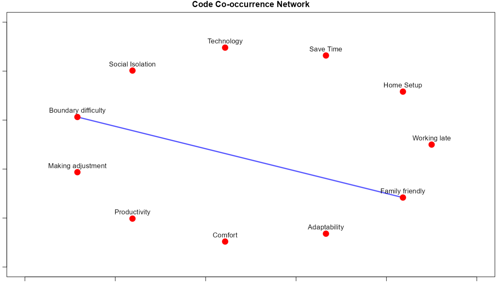
```

This visualization might reveal that "Boundary difficulty" and "Family friendly" frequently co-occur, suggesting a relationship between these issues.

### Text Statistics

The "Analysis" tab also provides basic text statistics:

1. Word count
2. Character count
3. Sentence count
4. Percentage of text that has been coded

These statistics can help you track your coding progress and provide context for your analysis.

## Step 7: Creating Themes

Sometimes multiple codes may share the same underlying theme and you may want to create a theme that encompasses several codes. Let's create a logical hierarchy of themes and codes. Go to the "Themes" tab:

1. Click "Add Theme" and create the following themes:
   - "Challenges"
   - "Benefits"
   - "Tools"
   - "Work-Life Balance"

2. For each theme, add relevant codes:

   For "Challenges":
   - Click "Add Code to Theme"
   - Select "Challenges" as the parent theme
   - Add codes like "Technical Issues", "Social Isolation", "Home Setup"

When finished, your code hierarchy should look something like this:

```{r, out.width = "700px", echo=FALSE}
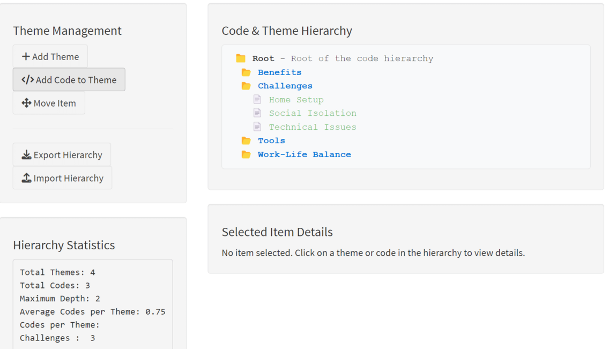
```

## Step 8: Exporting Results

### Saving Annotations

To save your annotations for further analysis or sharing:

1. Go to the "Records" tab
2. Click "Save Records"
3. Choose CSV format
4. Name your file "remote_work_analysis.csv"

```{r, out.width = "700px", echo=FALSE}
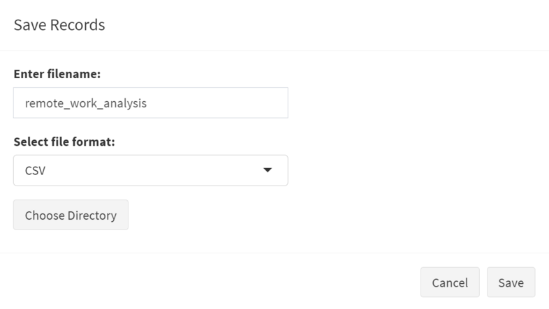
```

### Exporting Annotated Text

To save the annotated text with all coding highlights:

1. In the "Code and Memo" tab, click "Save Annotated Text"
2. Select HTML format to preserve color coding
3. Name your file "annotated_interview.html"

## Step 9: Project Comparison (Two Coders)

If you're working with a team where two researchers code the same text, you can use the comparison tools:

1. Have each team member code the interview independently
2. Save each person's annotations as CSV files
3. Go to the "Comparison" tab
4. Upload both CSV files
5. Run the comparison to see inter-coder agreement and differences

```{r, out.width = "400px", echo=FALSE}
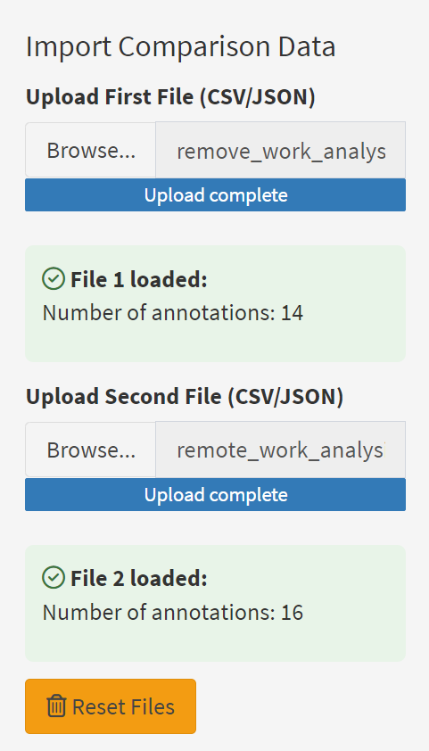
```

```{r, out.width = "400px", echo=FALSE}
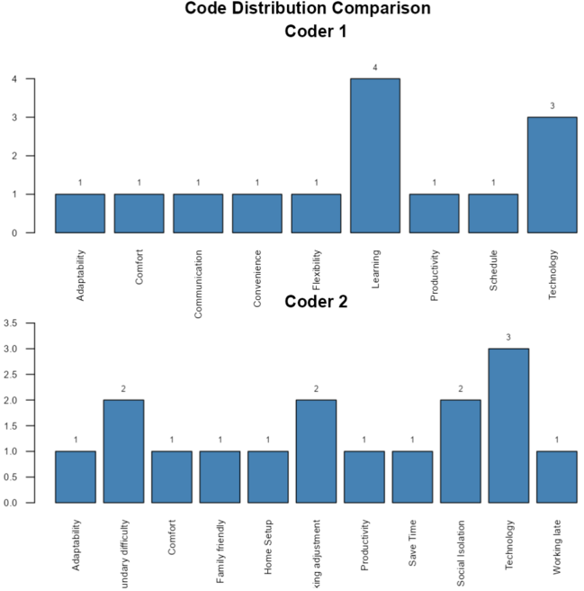
```

# Getting the Sample Project

To practice with this exact example, you can download a starter project from the textAnnotatoR GitHub repository:

```{r eval=FALSE}
# If you have the remotes package installed
remotes::install_github("chaoliu-cl/textAnnotatoR", build_vignettes = TRUE)

# Or browse to:
# https://github.com/chaoliu-cl/textAnnotatoR/inst/extdata/sample_projects
```

The sample projects include the interview text file used for this demonstration and a word file that contains Martin Luther King Jr.'s "I have a dream" speech.

---

*Note: Screenshots and example outputs in this vignette are for illustration purposes. Your actual interface may vary slightly depending on your operating system, R version, and package version.*
