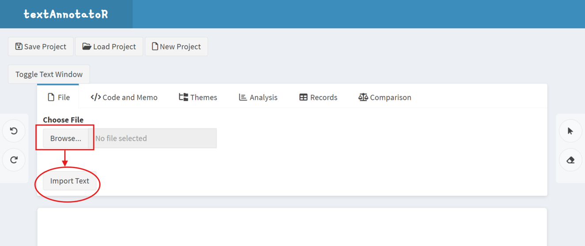
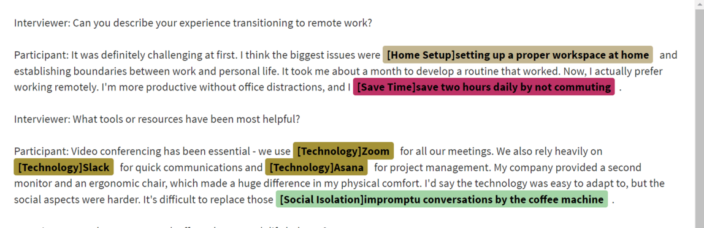

```{r setup, include=FALSE}
knitr::opts_chunk$set(
  collapse = TRUE,
  comment = "#>",
  fig.width = 3,
  fig.height = 5,
  fig.align = 'center',
  fig.path = "man/figures/"
)
library(textAnnotatoR)
```

# Introduction

This vignette provides a step-by-step practical example of using the textAnnotatoR package for qualitative analysis. We'll work through a complete example project, from importing text to analyzing coded content. You'll learn how to:

1. Set up a project
2. Import text data
3. Annotate text
4. Analyze patterns within coded data
5. Export results

# Sample Project: Analyzing Interview Responses

For this example, we'll be analyzing fictional interview responses about remote work experiences. The example demonstrates how you might use textAnnotatoR in a real qualitative research context.

## Step 1: Starting a New Project

First, let's launch the textAnnotatoR interface and create a new project:

```{r eval=FALSE}
library(textAnnotatoR)
annotate_gui()
```

When the interface loads, click "New Project" in the top toolbar:

```{r, out.width = "700px", echo=FALSE}
knitr::include_graphics("../man/figures/new_project_creation.png")
```

## Step 2: Importing Text Data

For this example, we'll use the following interview excerpt. You can copy this text into a file named `remote_work_interview.txt`:

```
Interviewer: Can you describe your experience transitioning to remote work?

Participant: It was definitely challenging at first. I think the biggest issues were setting up a proper workspace at home and establishing boundaries between work and personal life. It took me about a month to develop a routine that worked. Now, I actually prefer working remotely. I'm more productive without office distractions, and I save two hours daily by not commuting.

Interviewer: What tools or resources have been most helpful?

Participant: Video conferencing has been essential - we use Zoom for all our meetings. We also rely heavily on Slack for quick communications and Asana for project management. My company provided a second monitor and an ergonomic chair, which made a huge difference in my physical comfort. I'd say the technology was easy to adapt to, but the social aspects were harder. It's difficult to replace those impromptu conversations by the coffee machine.

Interviewer: How has remote work affected your work-life balance?

Participant: It's a double-edged sword. I have more flexibility and time with family, but it's also harder to disconnect. Sometimes I find myself checking emails well into the evening, which wasn't a habit before. I've had to be intentional about setting working hours and sticking to them. Taking short walks during the day has become my substitute for the natural breaks that happened in the office.
```

Go to the "File" tab and:
1. Click "Choose File" to upload your `remote_work_interview.txt` 2. Click "Import Text"

```{r, out.width = "700px", echo=FALSE}

```

## Step 3: Annotating the Text

Now let's start coding our interview text:

1. Return to the text display area
2. Click the selection tool (cursor icon) in the right margin
3. Select text discussing the home workspace setup
4. In the "Code and Memo" tab, enter "Home Setup" as the code
5. Add a memo: "Initial challenge in transition to remote work"
6. Click "Save" to save the code

```{r, out.width = "700px", echo=FALSE}
knitr::include_graphics("../man/figures/annotate1.png")
```

Continue this process for other notable segments in the text. For example:

- Code Zoom, Slack, and Asana as "Technology"
- Code save two hours daily by not commuting as "Save Time"
- Code discussions of missed impromptu conversations as "Social Isolation"

Your annotated text will begin to look like this, with different colored highlights representing different codes:

```{r, out.width = "700px", echo=FALSE}

```

If you want to apply an existing code to the text, first highlight the text and click on "Apply Code", then choose the code you want to apply:

```{r, out.width = "700px", echo=FALSE}

```

## Step 4: Analyzing the Coded Data

Once you've coded the entire interview, use the analysis tools to examine patterns:

### Code Frequency Analysis

Go to the "Analysis" tab and click "Code Frequency". This will show which codes were mentioned most often:

```{r, out.width = "700px", echo=FALSE}
knitr::include_graphics("../man/figures/code_frequency.png")
```

In our example, we might see that "Making adjustment" and "Technology" appear most frequently, indicating these are significant aspects of the remote work experience for our participant.

### Code Co-occurrence Analysis

Click "Code Co-occurrence" to see relationships between different codes:

```{r, out.width = "700px", echo=FALSE}
knitr::include_graphics("../man/figures/co_occurrence.png")
```

This visualization might reveal that "Boundary difficulty" and "Family friendly" frequently co-occur, suggesting a relationship between these issues

## Optional Step: Creating Themes

Sometimes multiple codes may share the same underlying theme and you may want to create a theme that encompasses several codes. Let's create a logical hierarchy of themes and codes. Go to the "Themes" tab:

1. Click "Add Theme" and create the following themes:
   - "Challenges"
   - "Benefits"
   - "Tools"
   - "Work-Life Balance"

2. For each theme, add relevant codes:

   For "Challenges":
   - Click "Add Code to Theme"
   - Select "Challenges" as the parent theme
   - Add codes like "Technical Issues", "Social Isolation", "Home Setup"

When finished, your code hierarchy should look something like this:

```{r, out.width = "700px", echo=FALSE}
knitr::include_graphics("../man/figures/code_and_theme_hierarchy.png")
```

Continue for other themes with appropriate codes.

## Step 5: Exporting Results

### Saving Annotations

To save your annotations for further analysis or sharing:

1. Go to the "Records" tab
2. Click "Save Records"
3. Choose CSV format
4. Name your file "remote_work_analysis.csv"

```{r, out.width = "700px", echo=FALSE}
knitr::include_graphics("../man/figures/save_records.png")
```

### Exporting Annotated Text

To save the annotated text with all coding highlights:

1. In the "Code and Memo" tab, click "Save Annotated Text"
2. Select HTML format to preserve color coding
3. Name your file "annotated_interview.html"

## Step 6: Project Comparison (Two Coders)

If you're working with a team where two researchers code the same text, you can use the comparison tools:

1. Have each team member code the interview independently
2. Save each person's annotations as CSV files
3. Go to the "Comparison" tab
4. Upload both CSV files
5. Run the comparison to see inter-coder agreement and differences

```{r, out.width = "400px", echo=FALSE}
knitr::include_graphics("../man/figures//comparison_analysis.png")
```

```{r, out.width = "400px", echo=FALSE}
knitr::include_graphics("../man/figures/comparison_analysis2.png")
```


# Getting the Sample Project

To practice with this exact example, you can download a starter project from the textAnnotatoR GitHub repository:

```{r eval=FALSE}
# If you have the remotes package installed
remotes::install_github("chaoliu-cl/textAnnotatoR", build_vignettes = TRUE)

# Or browse to:
# https://github.com/chaoliu-cl/textAnnotatoR/inst/extdata/sample_projects
```

The sample projects include the interview text file used for this demonstration and a word file that contains Martin Luther King Jr.'s "I have a dream" speech.

---

*Note: Screenshots and example outputs in this vignette are for illustration purposes. Your actual interface may vary slightly depending on your operating system, R version, and package version.*
