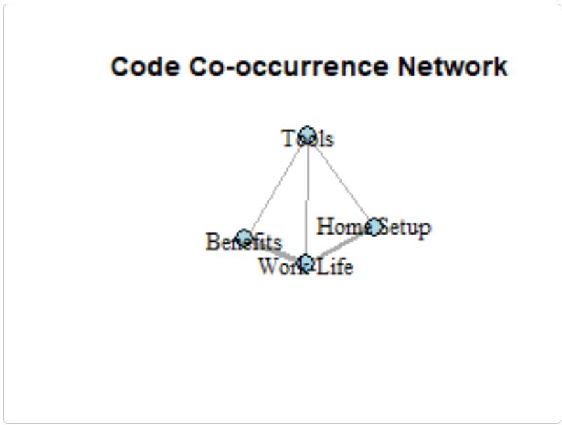
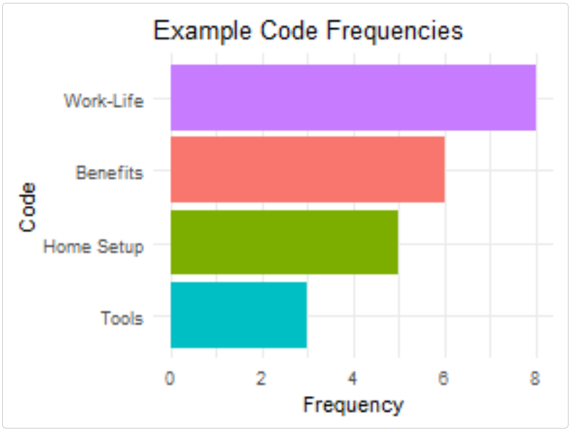

```{r setup, include=FALSE}
knitr::opts_chunk$set(
  collapse = TRUE,
  comment = "#>",
  fig.width = 4,
  fig.height = 3,
  fig.align = 'center',
  dpi = 72,
  out.width = "60%",
  fig.retina = NULL,
  dev = "png",
  fig.path = "figures/",
  message = FALSE,
  warning = FALSE
)
library(textAnnotatoR)
```

# Introduction

While textAnnotatoR provides a comprehensive GUI for annotation, its true power comes from integration with the broader R ecosystem. This vignette demonstrates how to integrate textAnnotatoR's outputs with other popular R packages for text analysis, visualization, and reporting.

# Understanding Data Structures

Before integrating with other tools, let's explore the structure of textAnnotatoR's data:

## Project Files

textAnnotatoR project files (.rds) contain the following components:

```{r echo = TRUE, results = 'hide'}
# First, ensure the project directory exists and is initialized
# We need to handle this explicitly when working outside the GUI
initialize_project_directory <- function() {
  # Get user documents directory as a safer default
  user_docs <- file.path(path.expand("~"), "Documents")
  
  # Create textAnnotatoR directory if it doesn't exist
  text_annotator_dir <- file.path(user_docs, "textAnnotatoR")
  if (!dir.exists(text_annotator_dir)) {
    dir.create(text_annotator_dir, recursive = TRUE)
  }
  
  # Create projects subdirectory
  projects_dir <- file.path(text_annotator_dir, "projects")
  if (!dir.exists(projects_dir)) {
    dir.create(projects_dir, recursive = TRUE)
  }
  
  return(projects_dir)
}

# Initialize the directory
projects_dir <- initialize_project_directory()

# Create a sample project for demonstration
project <- list(
  text = "Sample interview text content for demonstration purposes. This text contains information about remote work challenges and benefits.",
  annotations = data.frame(
    start = c(1, 25, 50, 80),
    end = c(10, 35, 60, 90),
    text = c("Sample", "interview", "demonstration", "remote work"),
    code = c("Sample", "Interview", "Demo", "Remote"),
    memo = c("Example memo", "Interview note", "Demo note", "Remote note"),
    stringsAsFactors = FALSE
  ),
  codes = c("Sample", "Interview", "Demo", "Remote"),
  code_tree = data.tree::Node$new("Root"),
  code_colors = c("Sample" = "#FF0000", "Interview" = "#00FF00", 
                  "Demo" = "#0000FF", "Remote" = "#FFCC00"),
  memos = list(),
  code_descriptions = list()
)

# Structure of a project
str(project, max.level = 1)
```

## Annotation Data Frame

The core annotation data is stored in a standard R data frame:

```{r eval=TRUE}
# View annotation structure
head(project$annotations)
```

This structure makes it readily compatible with standard R data manipulation tools.

# Integrating with Text Analysis Packages

## Using textAnnotatoR with quanteda

The [quanteda](https://quanteda.io/) package is a powerful framework for text analysis. Here's how to combine textAnnotatoR annotations with quanteda:

```{r eval=TRUE}
library(quanteda)
library(quanteda.textstats)
library(dplyr)

# Extract annotations by code
sample_texts <- project$annotations %>%
  filter(code == "Sample") %>%
  pull(text)

# Create a corpus from these text segments
sample_corpus <- corpus(sample_texts)

# Analyze with quanteda
sample_dfm <- dfm(tokens(sample_corpus))
textstat_frequency(sample_dfm, n = 5)  # Top 5 words
```

## Integration with tidytext

The [tidytext](https://www.tidytextmining.com/) package works beautifully with textAnnotatoR outputs:

```{r eval=FALSE}
library(tidytext)
library(ggplot2)

# Convert annotations to tidy format
tidy_annotations <- project$annotations %>%
  unnest_tokens(word, text) %>%
  anti_join(stop_words)

# Word frequency by code
word_frequencies <- tidy_annotations %>%
  count(code, word, sort = TRUE) %>%
  group_by(code) %>%
  top_n(5, n)

# Simple visualization
ggplot(word_frequencies, aes(reorder(word, n), n, fill = code)) +
  geom_col(show.legend = FALSE) +
  facet_wrap(~code, scales = "free") +
  coord_flip() +
  labs(title = "Top Words by Code",
       x = NULL,
       y = "Count")
```

# Enhanced Visualization

## Network Visualization with igraph

The following example demonstrates how to create network visualizations from co-occurrence patterns:

```{r, eval=FALSE}
library(igraph)
library(ggplot2)

# Create a simple matrix of code co-occurrences
codes <- c("Home Setup", "Work-Life", "Tools", "Benefits")
co_matrix <- matrix(c(
  0, 2, 1, 0,  # Home Setup
  2, 0, 1, 3,  # Work-Life
  1, 1, 0, 1,  # Tools
  0, 3, 1, 0   # Benefits
), nrow = 4, byrow = TRUE)

rownames(co_matrix) <- colnames(co_matrix) <- codes

# Create a graph
g <- graph_from_adjacency_matrix(
  co_matrix,
  mode = "undirected",
  weighted = TRUE,
  diag = FALSE
)

# Basic plot
plot(g, 
     vertex.color = "lightblue",
     vertex.size = 30,
     vertex.label.color = "black",
     edge.width = E(g)$weight,
     main = "Code Co-occurrence Network")
```
```{r, out.width = "400px", echo=FALSE}

```

## Simple Visualizations with ggplot2

Create static visualizations of your code frequencies:

```{r, eval=FALSE}
# Create a base ggplot with code frequencies
code_freq <- data.frame(
  code = codes,
  frequency = c(5, 8, 3, 6)
)

# Create a simple bar chart
ggplot(code_freq, aes(reorder(code, frequency), frequency, fill = code)) +
  geom_col() +
  coord_flip() +
  theme_minimal() +
  labs(title = "Example Code Frequencies", x = "Code", y = "Frequency") +
  theme(legend.position = "none")
```
```{r, out.width = "400px", echo=FALSE}

```

# Batch Processing and Automation

## Processing Multiple Documents

For projects with multiple documents, you can automate the workflow:

```{r eval=FALSE}
# Function to process a single document
process_document <- function(file_path, coding_scheme) {
  # Import text
  text <- readLines(file_path, warn = FALSE)
  text <- paste(text, collapse = "\n")
  
  # Create a new project structure
  project <- list(
    text = text,
    annotations = data.frame(
      start = integer(),
      end = integer(),
      text = character(),
      code = character(),
      memo = character(),
      stringsAsFactors = FALSE
    ),
    codes = coding_scheme$codes,
    code_tree = coding_scheme$code_tree,
    code_colors = coding_scheme$code_colors,
    memos = list(),
    code_descriptions = coding_scheme$code_descriptions
  )
  
  # Save as a textAnnotatoR project
  project_name <- paste0(basename(tools::file_path_sans_ext(file_path)), ".rds")
  saveRDS(project, file.path(projects_dir, project_name))
  
  cat("Processed:", file_path, "\n")
  return(project_name)
}

# Example of processing a folder of documents
# files <- list.files("interview_transcripts", pattern = "*.txt", full.names = TRUE)
# processed_projects <- sapply(files, process_document, coding_scheme = master_scheme)
```

## Export to Other Formats

Convert textAnnotatoR annotations to formats compatible with other QDA software:

```{r eval=FALSE}
# Basic export to CSV
export_to_csv <- function(project, output_file) {
  write.csv(project$annotations, output_file, row.names = FALSE)
  return(output_file)
}

# Example of exporting annotations
# export_to_csv(project, "project_annotations.csv")
```

# Integration with Reporting Tools

## Creating Reports with R Markdown

Generate comprehensive reports from your textAnnotatoR analyses:

```{r eval=FALSE}
library(rmarkdown)

# Function to generate a simple report
generate_analysis_report <- function(project, output_file = "analysis_report.html") {
  # Create a temporary Rmd file
  temp_rmd <- tempfile(fileext = ".Rmd")
  
  # Write R Markdown content
  writeLines(
    c("---",
      "title: 'Qualitative Analysis Report'",
      "output: html_document",
      "---",
      "",
      "```{r setup, include=FALSE}",
      "knitr::opts_chunk$set(echo = FALSE)",
      "```",
      "",
      "# Analysis Overview",
      "",
      "This report presents findings from qualitative analysis using textAnnotatoR.",
      "",
      "## Document Statistics",
      "",
      "```{r}",
      "stats <- data.frame(",
      "  Metric = c('Total Words', 'Total Annotations', 'Unique Codes'),",
      paste0("  Value = c(length(strsplit(project$text, '\\\\W+')[[1]]), nrow(project$annotations), length(project$codes))"),
      ")",
      "knitr::kable(stats)",
      "```",
      "",
      "## Annotations Table",
      "",
      "```{r}",
      "knitr::kable(project$annotations)",
      "```"
    ),
    temp_rmd
  )
  
  # Render the report
  rmarkdown::render(temp_rmd, output_file = output_file)
  
  return(output_file)
}
```

# Performance Tips

## Working with Large Documents

For very large documents, consider these optimization strategies:

```{r eval=FALSE}
# Split large documents into manageable chunks
split_large_document <- function(file_path, chunk_size = 5000) {
  text <- readLines(file_path, warn = FALSE)
  text <- paste(text, collapse = "\n")
  
  # Split into chunks
  chunks <- list()
  for (i in seq(1, nchar(text), by = chunk_size)) {
    end_pos <- min(i + chunk_size - 1, nchar(text))
    chunks[[length(chunks) + 1]] <- substr(text, i, end_pos)
  }
  
  # Save chunks
  chunk_files <- character(length(chunks))
  for (i in seq_along(chunks)) {
    filename <- paste0(tools::file_path_sans_ext(basename(file_path)), 
                      "_chunk", i, ".txt")
    writeLines(chunks[[i]], filename)
    chunk_files[i] <- filename
  }
  
  return(chunk_files)
}

# Optimize annotations for performance
optimize_annotations <- function(project) {
  # Remove duplicate annotations
  project$annotations <- unique(project$annotations)
  
  # Sort by position
  project$annotations <- project$annotations[order(project$annotations$start), ]
  
  return(project)
}
```

## Batch Processing Tips

When working with multiple files or team members:

```{r eval=FALSE}
# Function to merge annotations from multiple coders
merge_annotations <- function(annotation_files, output_file = "merged_annotations.csv") {
  # Read all annotation files
  all_annotations <- lapply(annotation_files, read.csv, stringsAsFactors = FALSE)
  
  # Add coder column to each set
  for (i in seq_along(all_annotations)) {
    all_annotations[[i]]$coder <- paste0("Coder", i)
  }
  
  # Combine all annotations
  merged <- do.call(rbind, all_annotations)
  
  # Write to CSV
  write.csv(merged, output_file, row.names = FALSE)
  
  return(output_file)
}

# Example usage:
# merge_annotations(c("coder1_annotations.csv", "coder2_annotations.csv"))
```

# Conclusion

This vignette demonstrates how to leverage textAnnotatoR's data structures to integrate with the broader R ecosystem. By combining the intuitive annotation interface with powerful R packages for analysis and visualization, you have more control over your qualitative analysis workflow.

The examples provided here use simple data to demonstrate the concepts while keeping the package size reasonable. In practice, you would use your actual project data and might need to modify these functions to match your specific requirements.

---

*Note: Some code examples use `eval=FALSE` to prevent large outputs during package building while still showing the code for demonstration purposes.*
